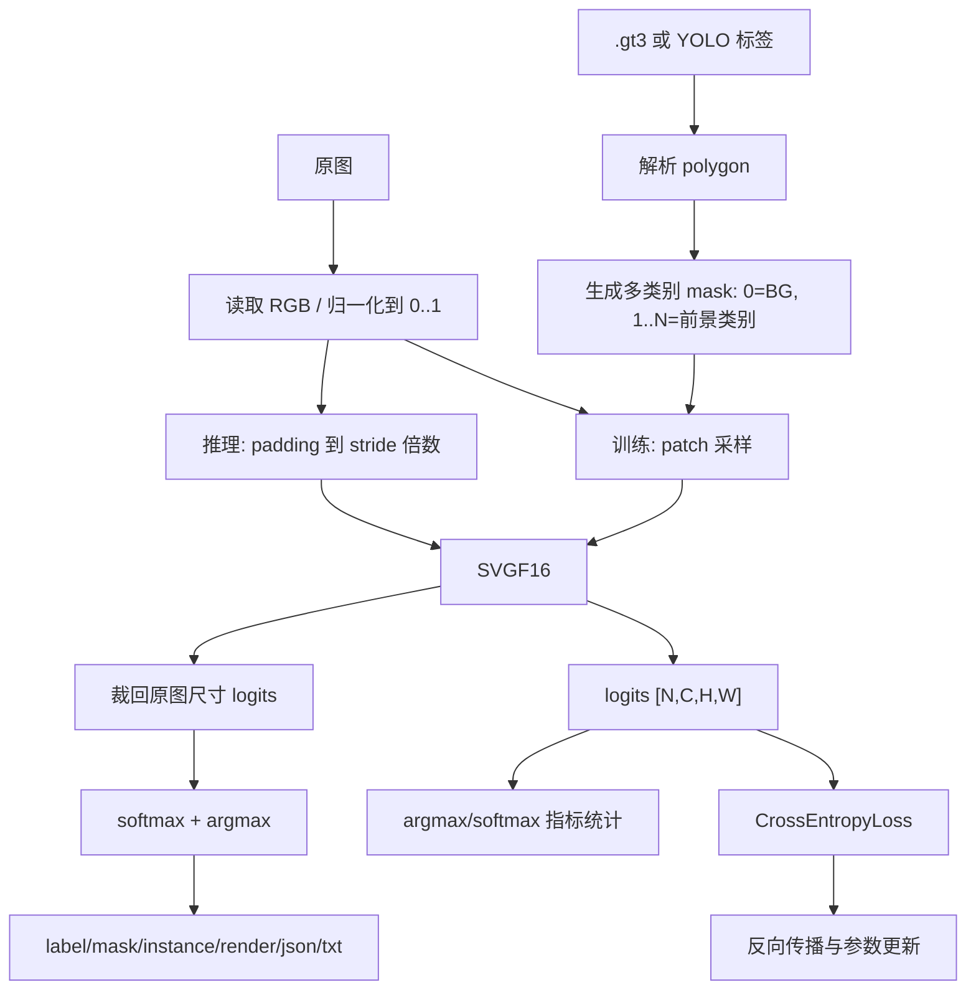

# SegPyProject 训练与推理技术说明

本文档说明 `SegPyProject` 当前 PyTorch 分割工程的训练、推理、patch 采样、多尺寸兼容、多类别标签、loss 反向传播和实例化后处理逻辑。对应代码主要位于：

| 模块 | 作用 |
|---|---|
| `dataloader.py` | `.gt3` / YOLO segmentation 数据集加载、mask 生成、patch 采样 |
| `gt3_parser.py` | 解析 TeAiFlow `.gt3` 轮廓，生成多类别 mask |
| `yolo_parser.py` | 解析 YOLO segmentation polygon 标签，生成多类别 mask |
| `seg_models.py` | SVGF16 网络结构，按感受野动态构建深度和输出通道 |
| `train.py` | 训练入口、loss、反向传播、pos_acc/neg_acc、checkpoint 保存 |
| `predict.py` | `.pt` 模型推理、变尺寸 padding、输出保存 |
| `instance_postprocess.py` | 将语义分割 logits 转成 YOLO-Seg 风格 instance 结果 |

## 1. 整体数据流



训练和推理都不做 resize，也不做 mean/std 标准化。图像统一转 RGB，像素值使用 `float32 / 255.0`。

## 2. 标签与类别规则

当前工程是多类别语义分割，统一标签规则如下：

| mask 像素值 | 含义 |
|---:|---|
| `0` | 背景 `BG` |
| `1` | 第 1 个前景类别，例如 `缺陷1` |
| `2` | 第 2 个前景类别，例如 `缺陷2` |
| `N` | 第 N 个前景类别 |

`.gt3` 数据在 `gt3_parser.py` 中解析：

- 每个有效轮廓读取真实 float32 polygon 点。
- 每个轮廓从 `offset - 24` 读取 `raw_gt_value`。
- 训练类别映射为 `class_id = raw_gt_value - 2`。
- 当前已验证规则：`raw_gt_value=3 -> class_id=1`，`raw_gt_value=4 -> class_id=2`。
- `class_id <= 0` 的轮廓视为非训练前景，不写入 mask。
- `annotation_to_mask()` 使用 `PIL.ImageDraw.polygon(..., fill=class_id)` 生成多类别 mask。

YOLO segmentation 数据在 `yolo_parser.py` 中解析：

- 每行格式为 `class x1 y1 x2 y2 ...`，坐标要求归一化到 `[0,1]`。
- YOLO 的 `class_id` 从 `0` 开始，但训练 mask 背景占用 `0`，所以写入 mask 时使用 `class_id + 1`。
- 类别名优先来自 `dataset.yaml` 的 `names`，否则根据最大 label 自动生成 `class_1`、`class_2` 等。

## 3. 为什么使用 patch 训练

训练使用 patch，不直接把整张图塞进 batch，主要有四个原因：

1. **兼容不同尺寸图片**

   PyTorch `DataLoader` 默认会把一个 batch 中的样本堆叠成同一个 tensor，要求同一 batch 内 `H/W` 一致。项目中的图片尺寸不同，如果直接整图训练，需要复杂的动态 batch padding 或 batch size 只能为 1。patch 训练把每个样本裁成固定大小，天然可以组成 batch。

2. **降低显存和内存压力**

   分割模型输出是 `[N, C, H, W]`，整图越大，logits、梯度和中间特征图占用越高。patch 训练只在局部区域上计算 forward/backward，显存更稳定。

3. **提高前景样本出现概率**

   缺陷分割通常前景区域很小。整图训练时，大部分像素都是背景，模型容易学成“全背景”。`positive_ratio` 会让一部分 patch 围绕前景像素裁剪，提高前景参与训练的概率。

4. **匹配感受野对应的上下文**

   感受野越大，模型结构越深，需要更大的输入 patch 提供足够上下文。工程中默认使用：

| 感受野 | 默认 patch size | 推理 padding stride | 编码最大通道 |
|---:|---:|---:|---:|
| RF32 | 256 | 8 | 64 |
| RF64 | 512 | 16 | 128 |
| RF128 | 768 | 32 | 256 |
| RF256 | 1024 | 64 | 512 |

映射来自 `utils.py`：

```python
receptive_field_to_patch_size = {32: 256, 64: 512, 128: 768, 256: 1024}
receptive_field_to_stride = {32: 8, 64: 16, 128: 32, 256: 64}
```

## 4. patch 是如何处理的

patch 采样由 `dataloader.py` 的 `_PatchSegDataset` 实现。

### 4.1 样本数量

```python
len(dataset) = len(samples) * samples_per_image
```

默认 `samples_per_image=64`。这意味着每张原图每个 epoch 会随机抽取多个 patch，而不是只使用一次固定裁剪。

### 4.2 原图与 mask 加载

每个样本包含：

- `image_path`
- `label_path`
- `sample_name`

加载流程：

1. `read_rgb_image()` 读取原图并转 RGB。
2. `.gt3` 或 YOLO label 解析成与原图同尺寸的多类别 mask。
3. 全图和 mask 会缓存在 `_sample_cache`，避免同一 epoch 多次 patch 采样时重复解析文件。

### 4.3 图像小于 patch 时如何处理

如果原图尺寸小于 patch size，会先 padding 到至少 patch size：

- 图像使用 `np.pad(..., mode="edge")`，即边缘像素复制。
- mask 使用常量 `0` padding，即新增区域视为背景。

这样可以保证后续裁剪永远得到固定大小 patch。

### 4.4 裁剪策略

`_choose_crop()` 先根据 `positive_ratio` 决定是否优先采前景：

- 当 `random.random() < positive_ratio` 且 mask 中存在前景像素时：
  - 随机选一个 `mask > 0` 的像素。
  - 以该像素为中心附近裁剪 patch。
  - 如果靠近边界，则用 `np.clip` 把左上角限制在合法范围内。
- 否则：
  - 在整张图合法范围内随机裁剪。

默认 `positive_ratio=0.5`，即约一半 patch 会尝试围绕前景采样，另一半保持随机背景/上下文采样。

### 4.5 输出给模型的数据格式

每个 dataset item 返回：

| 字段 | shape / dtype | 说明 |
|---|---|---|
| `image` | `[3, patch, patch] float32` | RGB，值域 `0..1` |
| `mask` | `[patch, patch] int64` | 多类别 label，`0=BG` |
| `crop` | `[x0, y0, x1, y1] int64` | 当前 patch 在 padding 后图像中的坐标 |
| `image_path` / `label_path` | string | 溯源信息 |

图像从 HWC 转成 CHW：

```python
image_tensor = torch.from_numpy(image_patch.transpose(2, 0, 1)).float()
mask_tensor = torch.from_numpy(mask_patch.astype(np.int64))
```

## 5. 训练如何兼容不同尺寸图片

训练阶段通过“固定 patch 尺寸”兼容不同尺寸图片。

原图可以是任意尺寸，例如：

```text
793 x 598
1020 x 927
2448 x 2048
```

但进入 `DataLoader` 的 tensor 都是：

```text
image: [3, patch_size, patch_size]
mask:  [patch_size, patch_size]
```

因此 `DataLoader(batch_size=4)` 可以堆叠为：

```text
images: [4, 3, patch_size, patch_size]
masks:  [4, patch_size, patch_size]
```

训练时不需要把不同原图 resize 到同一尺寸，也不会破坏原图坐标比例。不同尺寸的差异被 patch 裁剪吸收了。

## 6. SVGF16 网络如何适配感受野和多类别

`seg_models.py` 中 `SVGF16` 根据 `receptive_field` 动态选择编码通道：

| 感受野 | 编码通道列表 |
|---:|---|
| 32 | `[16, 32, 64]` |
| 64 | `[16, 32, 64, 128]` |
| 128 | `[16, 32, 64, 128, 256]` |
| 256 | `[16, 32, 64, 128, 256, 512]` |

网络输出始终是：

```text
logits: [N, num_classes, H, W]
```

其中 `num_classes` 来自数据集类别数量：

- `.gt3` 当前通常是 `3`：`BG / 缺陷1 / 缺陷2`
- YOLO 数据集是 `1 + names数量`

最后一层是：

```python
self.classifier = nn.Conv2d(32, num_classes, kernel_size=3, padding=1, bias=False)
```

所以类别数变化时，只有 classifier 输出通道随之变化，前面的特征提取结构仍由感受野决定。

模型 forward 中会把最终输出插值回输入尺寸：

```python
logits = F.interpolate(logits, size=input_size, mode="bilinear", align_corners=False)
```

因此训练时只要输入 patch 是 `[patch, patch]`，输出 logits 也会是同样的空间尺寸，能和 mask 做逐像素 loss。

## 7. 训练流程与反向传播

训练入口在 `train.py`：

```python
criterion = torch.nn.CrossEntropyLoss()
optimizer = torch.optim.Adam(model.parameters(), lr=args.lr)
```

每个 batch 的核心流程是：

```python
logits = model(images)
loss = criterion(logits, masks)
loss.backward()
optimizer.step()
```

### 7.1 CrossEntropyLoss 的输入含义

`CrossEntropyLoss` 接收：

```text
logits: [N, C, H, W] float32
masks:  [N, H, W] int64
```

其中：

- `C = num_classes`
- `masks[y,x]` 是该像素的真实类别 id
- 不需要手动对 logits 做 softmax，PyTorch 内部会做 `log_softmax + NLLLoss`

### 7.2 前景和背景如何参与反向传播

当前代码没有把前景 loss 和背景 loss 分开写，也没有单独的二分类 loss。背景和所有前景类别都通过同一个逐像素多类别交叉熵参与反向传播。

对一个像素而言：

- 如果真实 mask 是 `0`，该像素是背景像素，loss 会推动模型提高 `BG` 通道 logit，压低其他前景通道。
- 如果真实 mask 是 `1`，该像素是第 1 个前景类别，loss 会推动模型提高类别 `1` 的 logit，压低 `BG` 和其他前景类别。
- 如果真实 mask 是 `2`，该像素是第 2 个前景类别，loss 会推动模型提高类别 `2` 的 logit，压低 `BG` 和其他类别。

换句话说，前景和背景的“反向传播”不是两条单独分支，而是同一个多类别 softmax 竞争过程：

```text
每个像素只属于一个目标类别
目标类别概率越低，该像素产生的 loss 越大
loss.backward() 会把所有像素的梯度汇总后更新模型参数
```

### 7.3 positive_ratio 影响什么，不影响什么

`positive_ratio` 只影响 patch 采样分布，不直接改变 loss 公式。

它会让更多 patch 包含前景像素，从而让前景像素在训练中更频繁出现。但当前 `CrossEntropyLoss()` 没有传入 class weight，所以在一个 batch 内，每个像素默认权重相同。

这意味着：

- `positive_ratio` 是一种数据采样层面的前景增强。
- 不是 loss 层面的类别加权。
- 如果未来前景仍然太少，可以考虑增加 class weight 或 focal loss，但当前代码没有实现。

## 8. pos_acc / neg_acc 如何计算

训练日志中的 `pos_acc` 和 `neg_acc` 在 `train.py` 中计算，定义是二值前景/背景准确率，不区分具体缺陷类别：

```python
pred = torch.argmax(logits.detach(), dim=1)
target_pos = masks > 0
target_neg = masks == 0
pred_pos = pred > 0
pred_neg = pred == 0
```

指标含义：

| 指标 | 计算方式 | 含义 |
|---|---|---|
| `pos_acc` | `(pred>0 且 mask>0) / (mask>0)` | 真实前景像素中，被预测成任意前景的比例 |
| `neg_acc` | `(pred==0 且 mask==0) / (mask==0)` | 真实背景像素中，被预测成背景的比例 |

注意：`pos_acc` 不要求 `缺陷1` 和 `缺陷2` 分类正确，只判断有没有识别成前景。多类别分类是否正确由 `CrossEntropyLoss` 负责优化，但当前日志没有单独输出 `class_acc`。

日志示例：

```text
epoch=2/100 loss=0.159912 pos_acc=0.9876 neg_acc=0.9951
```

如果某个 epoch 没有前景像素，`pos_acc=nan` 并输出 warning；如果没有背景像素，`neg_acc=nan` 并输出 warning。

## 9. 多类别前景如何分类

模型不是先做“是否前景”，再做“前景属于哪类”的两阶段结构。它是一次性输出所有类别通道：

```text
channel 0: BG
channel 1: 缺陷1
channel 2: 缺陷2
...
```

训练时，每个像素的目标类别就是 mask 像素值。`CrossEntropyLoss` 会让所有类别通道在该像素位置竞争。

推理时，类别由最大 logit 决定：

```python
label = argmax(logits, channel)
```

解释：

- `label=0`：背景
- `label=1`：缺陷1
- `label=2`：缺陷2
- `label>0`：任意前景

因此二值 mask 只是从多类别 label 派生出来：

```python
binary_mask = (label_map > 0) * 255
```

## 10. 推理如何兼容不同尺寸图片

推理阶段不使用 patch，也不 resize。它直接对整张图推理，但会 padding 到模型 stride 的整数倍。

流程在 `predict.py`：

1. 读取单图或文件夹下所有图片。
2. 转 RGB，归一化到 `0..1`。
3. 根据 checkpoint 中的感受野计算 stride：

   | 感受野 | stride |
   |---:|---:|
   | 32 | 8 |
   | 64 | 16 |
   | 128 | 32 |
   | 256 | 64 |

4. 使用 `pad_array_to_stride(..., mode="edge")` 只在右侧和底部 padding。
5. 转成 `[1,3,H,W]` 输入模型。
6. 得到 logits 后裁回原图尺寸：

   ```python
   logits = logits_tensor.numpy()[:, :original_h, :original_w]
   ```

为什么推理不用 resize：

- resize 会改变缺陷尺寸和边界位置。
- 当前模型是全卷积结构，理论上支持任意 H/W。
- 只要 padding 到 stride 倍数，就能让 pooling/deconv 路径更稳定。

推理的坐标仍然是原图坐标，因为 padding 只加在右边和下边，输出又裁回原图尺寸。

## 11. 推理后处理与实例结果

SVGF16 本质是语义分割模型，不是 YOLO 原生 instance segmentation 模型。`instance_postprocess.py` 把语义分割结果转换成轻量实例结果。

后处理流程：

1. 对 logits 做 softmax。
2. 对每个像素做 argmax 得到 `label_map`。
3. `label_map > 0` 得到二值前景 mask。
4. 对每个前景类别单独做 8 邻域连通域。
5. 每个连通域作为一个 instance。
6. instance score 是该区域内对应类别 softmax 概率均值。
7. 用 OpenCV 提取 polygon 和 bbox。
8. 按 score 排序，执行同类 mask IoU NMS。
9. 最多保留 `max_det` 个实例。

输出文件：

| 文件 | 说明 |
|---|---|
| `*_label.png` | 多类别 label 图，像素值 `0..N` |
| `*_mask.png` | 二值前景图，`0/255` |
| `*_instances.png` | 实例 id 图，`0=背景`，`1..K=实例 id` |
| `*_render.png` | 带 mask、polygon、bbox、类别名、score 的渲染图 |
| `*_results.json` | 完整实例结果 |
| `*_results.txt` | 每行 `cls score x1 y1 x2 y2 ... xn yn` |

JSON 中每个 instance 包含：

```json
{
  "id": 1,
  "cls": 0,
  "class_id": 1,
  "class_name": "缺陷1",
  "score": 0.98,
  "polygon": [[x1, y1], [x2, y2]],
  "bbox": [x1, y1, x2, y2],
  "area": 1234
}
```

其中：

- `class_id` 是 label 图中的类别 id，背景占 `0`。
- `cls` 是 YOLO 风格前景类别 id，不包含背景，所以 `cls = class_id - 1`。
- `score` 保留两位小数。
- `polygon` 使用原图像素坐标，不归一化。

## 12. 训练与推理尺寸处理对比

| 阶段 | 是否 resize | 是否 patch | 是否 padding | 输出如何对齐 |
|---|---|---|---|---|
| 训练 | 否 | 是，固定 patch size | 小图不足 patch 时 padding | logits 与 patch mask 同尺寸 |
| 推理 | 否 | 否，整图推理 | padding 到 stride 倍数 | logits 裁回原图尺寸 |

训练用 patch 是为了解决 batch 尺寸统一、显存和前景稀疏问题；推理用整图是为了输出完整原图坐标结果。

## 13. checkpoint 保存内容

训练只在当前 epoch 的 `avg_loss` 优于历史最优时保存 checkpoint。保存内容包括：

- `model_state_dict`
- `model_config`
  - `class_name=SVGF16`
  - `receptive_field`
  - `in_channels=3`
  - `num_classes`
- `classes`
- `preprocessing`
  - `input_scale=0..1`
  - `patch_size`
  - `positive_ratio`
- `training`
  - `dataset_type`
  - `class_mode=multiclass`
  - `epoch`
  - `best_loss`
  - `batch_size`
  - `lr`
  - 数据路径与样本数
- `pretrain_report`

推理时 `predict.py` 会从 checkpoint 恢复：

- `receptive_field`
- `num_classes`
- `classes`
- `model_state_dict`

因此模型输出通道数和类别名以 checkpoint 为准。

## 14. 常见现象解释

### 14.1 为什么 loss 降了，但推理还是大片误检

可能原因：

- 训练数据太少或 patch 数不足。
- 正负样本比例不合适。
- 使用了旧 checkpoint 或旧 ONNX。
- 多类别 mask 解析不正确。
- 推理时没有按 RGB `/255.0` 输入。
- 推理图像和训练图像分布差异大。

### 14.2 为什么 pos_acc 高但 neg_acc 低

说明模型倾向于把很多像素预测为前景。它能覆盖前景，但背景误检多。可以考虑：

- 降低 `positive_ratio`，增加随机背景 patch。
- 增加背景图或空标注样本，目前 `.gt3` 数据不允许空 mask，YOLO 数据允许空标签。
- 后处理提高 `conf`，但这只影响实例输出，不改变模型本身。

### 14.3 为什么 neg_acc 高但 pos_acc 低

说明模型偏向背景，前景召回不足。可以考虑：

- 增加 `positive_ratio`。
- 增加 `samples_per_image`。
- 检查 mask 是否正确生成前景。
- 训练更多 epoch。

### 14.4 为什么多类别下 pos_acc 不代表类别准确率

当前 `pos_acc` 只判断是否预测为前景。例如真实是 `缺陷2`，预测成 `缺陷1`，它仍然算作 `pos_acc` 正确，但 `CrossEntropyLoss` 会继续惩罚这个类别错误。

如果需要观察具体类别分类效果，可以后续新增：

```text
class_acc = pred == masks 在 mask>0 区域的准确率
per_class_iou
per_class_acc
```

当前代码还没有输出这些指标。

## 15. 典型命令

`.gt3` 训练：

```powershell
py E:\TruthEye\WorkDir\SegPyProject\train.py `
  --gt-dir E:\TruthEye\WorkDir\testSegemnt\TestSeg\2 `
  --receptive-field 64 `
  --batch-size 4 `
  --epochs 100
```

YOLO segmentation 训练：

```powershell
py E:\TruthEye\WorkDir\SegPyProject\train.py `
  --dataset-type yolo `
  --dataset-yaml E:\path\to\dataset.yaml `
  --split train `
  --receptive-field 64
```

单图推理：

```powershell
py E:\TruthEye\WorkDir\SegPyProject\predict.py `
  --checkpoint E:\TruthEye\WorkDir\SegPyProject\outputs\checkpoints\svgf16_rf64_best.pt `
  --image E:\TruthEye\WorkDir\testSegemnt\TestSeg\1\SrcImage\1_3@217_te_0.bmp `
  --output-dir E:\TruthEye\WorkDir\SegPyProject\outputs\predict_instances `
  --conf 0.2 `
  --iou 0.5 `
  --save-txt true `
  --show false `
  --max-det 1000
```

文件夹推理：

```powershell
py E:\TruthEye\WorkDir\SegPyProject\predict.py `
  --checkpoint E:\TruthEye\WorkDir\SegPyProject\outputs\checkpoints\svgf16_rf64_best.pt `
  --folder E:\TruthEye\WorkDir\testSegemnt\TestSeg\1\SrcImage `
  --output-dir E:\TruthEye\WorkDir\SegPyProject\outputs\predict_instances
```

## 16. 当前实现边界

- 当前训练 loss 是普通 `CrossEntropyLoss`，没有 class weight、focal loss 或 Dice loss。
- `.gt3` 数据默认不允许空 mask；YOLO 数据允许空标签。
- patch 采样没有做旋转、缩放、颜色增强等数据增强。
- 推理后处理的 instance 是从语义分割连通域派生的，不是模型直接预测的独立实例。
- 推理坐标不归一化，全部使用原图像素坐标。
- 训练不会保存每个 epoch 的全部历史指标，只在最终 JSON 返回最后一个 epoch 的 `lastPosAcc/lastNegAcc`。
